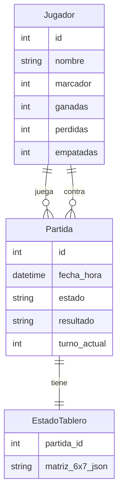

```mermaid
erDiagram
    Jugador ||--o{ Partida : juega
    Partida }o--|| Jugador : contra
    Partida ||--|| EstadoTablero : tiene

    Jugador {
        int id
        string nombre
        int marcador
        int ganadas
        int perdidas
        int empatadas
    }

    Partida {
        int id
        datetime fecha_hora
        string estado
        string resultado
        int turno_actual
    }

    EstadoTablero {
        int partida_id
        string matriz_6x7_json
    }
```
